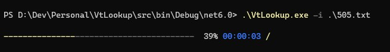

# VtLookup

Yet another VirusTotal lookup tool. This one is super basic, just does SHA256 file hash report lookups currently, dumps basic data to CSV. Mainly aimed at those with Enterprise API access e.g. large batch sizes. For example, with a batch size of 100, it does 10000 hashes in about a minute.

Has a nice little console progress bar :-)

